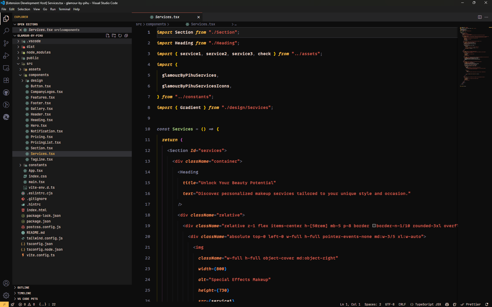
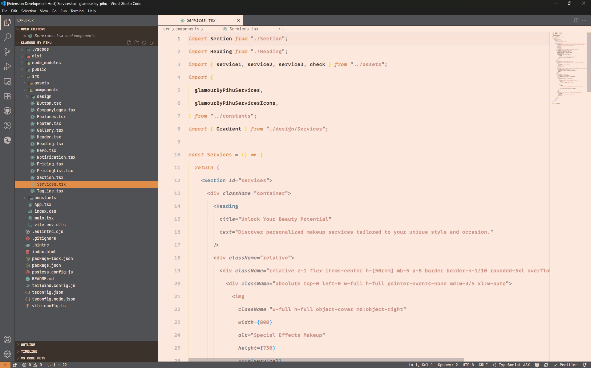

# 🎨 Code Glasses VS Code Themes

[](https://marketplace.visualstudio.com/items?itemName=shaant-shakti.code-glasses)
[](https://marketplace.visualstudio.com/items?itemName=shaant-shakti.code-glasses)
[](https://github.com/Aditya-Ace/Code-Glasses)
[](https://opensource.org/licenses/MIT)

A sophisticated duo of themes, meticulously crafted for developers who believe that a beautiful workspace leads to beautiful code. **Code Glasses** is more than a color scheme; it’s a new perspective on your editor, inspired by the soft, personal aesthetic of Google's Material You design principles.

This extension provides two distinct themes—one dark, one light—built on the same core principles of clarity, comfort, and architectural intelligence.

> "Finally, a dark theme that feels warm and focused, not just black. Vision is my new default for late-night coding."

> "The framed UI in Architect is a game-changer. It's the first light theme that actually helps me think."

---

### ✨ Code Glasses - Vision (Dark Theme)

**An immersive dark theme designed for calm focus and clarity.**

Tired of the standard high-contrast blue and purple dark themes? **Vision** offers a sophisticated alternative. Inspired by the warmth of a tranquil sunset, it pairs a deep, near-black slate background with vibrant terracotta and rich gold accents. The result is a comfortable yet engaging environment, perfect for long coding sessions deep into the night.

It’s a theme designed not just to be looked at, but to be looked _through_, letting you see your code with a new sense of purpose.

**Key Features:**

- **Premium Dark Experience:** A foundation of deep slate for reduced eye strain and a sophisticated feel.
- **Subtle Glassmorphism:** Floating UI elements use soft transparency to create a sense of depth and layering.
- **Warm, Semantic Highlighting:** A purposeful palette where keywords glow with sunset gold and strings resonate with warm terracotta.
- **Modern Font Ready:** Designed with strategic italics to perfectly complement fonts like MonoLisa, Fira Code, and JetBrains Mono.



---

### 💡 Code Glasses - Architect (Light Theme)

**A high-contrast light theme engineered to reveal the structure of your code.**

**Architect** challenges the traditional flat design of light themes. It introduces a unique "framed" interface where a dark, functional UI cockpit surrounds a warm, paper-like editor canvas. This architectural separation minimizes distractions and guides your focus directly to your code, creating a workspace that is both beautiful and intensely practical.

This theme is built on the belief that a great UI should help you think. By separating the code's architecture from its logic, Architect does exactly that.

**Key Features:**

- **High-Contrast Frame:** A dark charcoal sidebar and status bar create a focused "cockpit" view, eliminating peripheral noise.
- **Warm, Readable Canvas:** The editor features a soft, peachy background with deep bronze text for maximum readability and comfort.
- **True Architectural Highlighting:** A distinct **Structural Blue** is used for classes, interfaces, and types, allowing you to instantly distinguish foundational code from logic.
- **Flawless UI/UX:** Every icon and menu has been meticulously colored for perfect visibility and a frustration-free experience.



---

### 🚀 Installation

1.  Open the **Extensions** sidebar in VS Code (`Ctrl+Shift+X`).
2.  Search for `Code Glasses`.
3.  Click **Install**.
4.  Open the Command Palette (`Ctrl+Shift+P`), type `Preferences: Color Theme`, and select **Code Glasses - Vision** or **Code Glasses - Architect**.

### ⚙️ Recommended Settings

For the best possible experience, I highly recommend using a font that supports stylistic ligatures and enabling them in your settings.

```json
{
  "editor.fontFamily": "MonoLisa, Fira Code, JetBrains Mono, Operator Mono Lig, Cascadia Code, Consolas, monospace",
  "editor.fontLigatures": true
}
```

### 🧘 From the same creator...

If you enjoy themes that promote peace and mindfulness while you code, check out my other creation:

**[Shaant-Shakti Color Theme](https://marketplace.visualstudio.com/items?itemName=shaant-shakti.shaant-shakti-color-theme)** - A theme dedicated to bringing a sense of calm and powerful serenity to your editor.

---

### ❤️ Love The Themes? Support The Project!

A lot of time and care has gone into crafting these themes to be both beautiful and functional. If Code Glasses has improved your workflow and brought a little more joy to your coding, please consider supporting its future development.

Every donation helps and is greatly appreciated!

[](https://paypal.me/adityaace777)

Or directly at: **[paypal.me/adityaace777](https://paypal.me/adityaace777)**

---

### 🐞 Found an Issue or have a Suggestion?

This project is open source and I'd love to hear your feedback!

Feel free to open an issue or submit a pull request on the **[GitHub Repository](https://github.com/Aditya-Ace/Code-Glasses)**.

---

### License

This project is licensed under the MIT License. See the [LICENSE](LICENSE) file for details.
